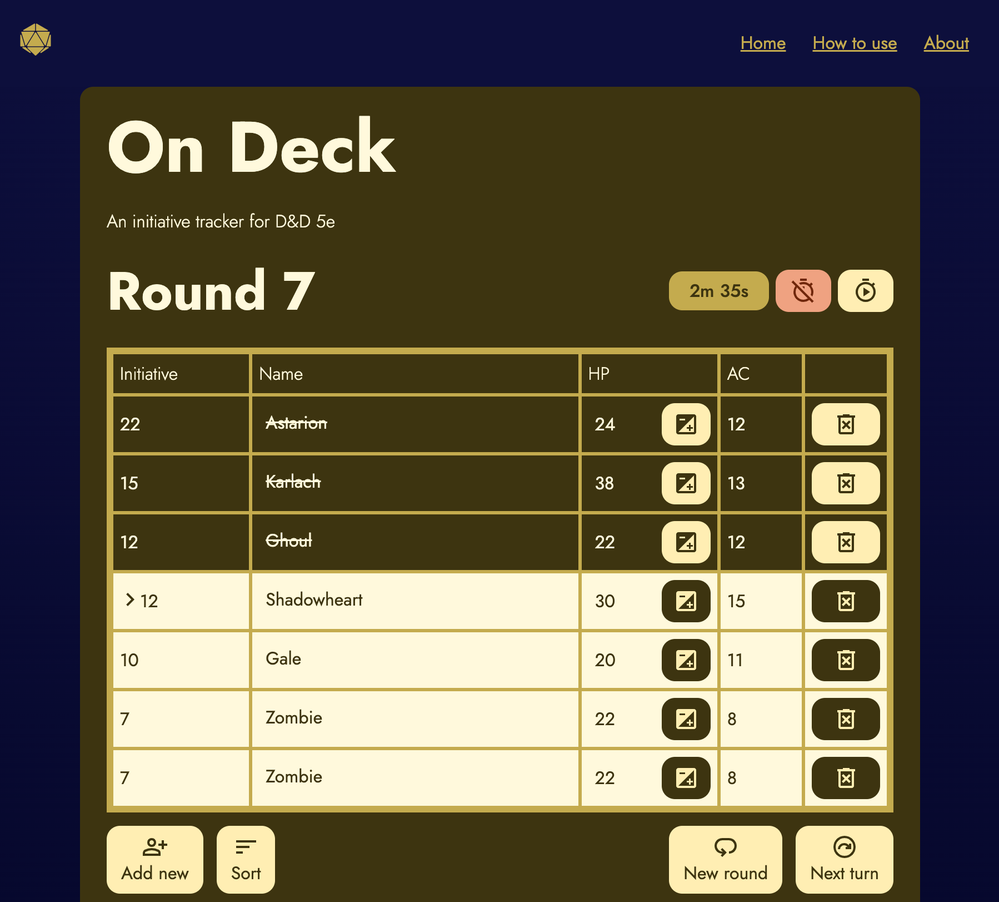
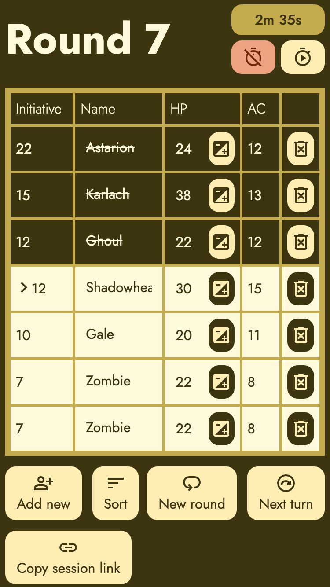
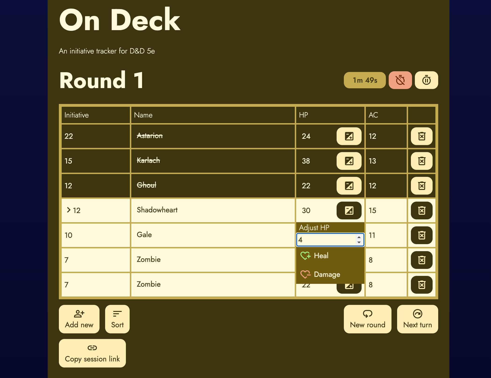
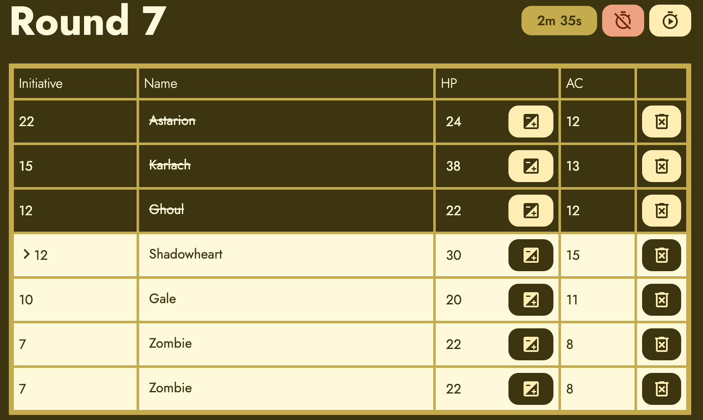

# On Deck

When you’re running a game in Dungeons & Dragons, there’s a lot of things you need to keep track of: rules, lore, ensuring everyone is having a good time, and space out snack breaks to keep up morale. During combat, there are even more moving parts than usual - Open Deck is a tool that can help reduce cognitive load during gameplay so the DM can focus on storytelling and player experience.

On Deck keeps track of initiative order, turns and rounds, as well as the health of player characters and monsters. 



## Table of Contents

- [Features](#features)
- [Tech stack](#tech-stack)
- [Installation](#installation)
- [Project Structure](#project-structure)
- [Screenshots](#screenshots)
- [Acknowledgements](#acknowledgements)
- [Authors](#authors)

   
## Features

- Keeps track of initiative order, turns, and rounds
- Sorts characters according to initiative 
- Autofills monster data from [D&D 5e API](https://www.dnd5eapi.co/)
- Tracker for HP and AC 
- Easy HP adjustment without mental arithmetics
- Stopwatch to either keep track of time so you don't play too long without a break, or to time indivudal players' turns
- Saves data in browser local storage, with the option to save the session via URL between devices
- Responsive layout that works on desktop, tablet, and mobile devices 

## Tech Stack


- Astro
- React
- Sass
- [D&D 5e API](https://www.dnd5eapi.co/)
- Vercel


## Installation

Install on-deck with npm:

```bash
  npm install on-deck
  cd on-deck
```


| Command                   | Action                                           |
| :------------------------ | :----------------------------------------------- |
| `npm install`             | Installs dependencies                            |
| `npm run dev`             | Starts local dev server at `localhost:4321`      |
| `npm run build`           | Build production site to `./dist/`          |
| `npm run preview`         | Preview build locally, before deploying     |
| `npm run test`       | Run tests |

## Project Structure

```text
/
├─ public/
├─ src/
│  ├─ __tests__/
│  ├─ assets/
│  │  └─ icons/
│  ├─ components/
│  │  ├─ tracker/
│  │  └─ utils/
│  ├─ layout/
│  ├─ lib/
│  │  └─ dnd5e/
│  │  │  ├─ mock/
│  │  │  └─ client.ts
│  ├─ pages/
│  │  ├─ api/
│  │  │  ├─ dnd5e/
│  │  │  │  └─ monster/
│  │  │  │     └─ [index].json.ts
│  │  │  └─ monsters.json.ts
│  │  ├─ about.astro
│  │  ├─ how-to.astro
│  │  └─ index.astro
│  ├─ styles/
│  └─ types/
├─ .gitignore
├─ README.md
├─ astro.config.mjs
├─ package-lock.json
├─ package.json
├─ tsconfig.json
└─ vitest.config.json
```

The project uses Astro's file-based routing system from the file layout in `src/pages/`.

Furthermore, `src/pages/api/dnd5e` is used for server endpoints for the API.

## Screenshots









## Acknowledgements

- Monster data from [D&D 5e API](https://www.dnd5eapi.co/)
- Icons from [Material Design](https://fonts.google.com/icons)
- [README.so](https://readme.so/)


## Authors

- [@maria-jon](https://www.github.com/maria-jon)
